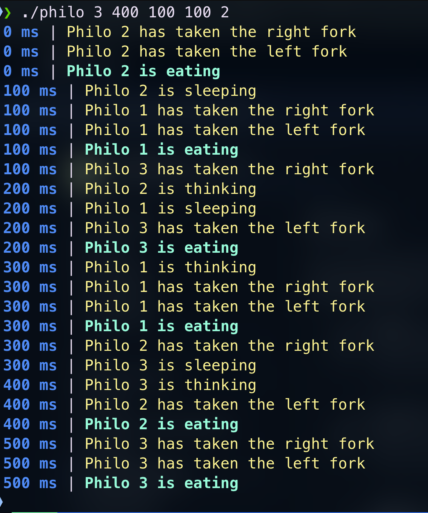

# Philosopher - Projet 42

## 🧠 Vue d'ensemble

**Philosopher** est un projet basé sur le célèbre problème des philosophes mangeurs. Le but est de simuler un groupe de philosophes qui alternent entre la réflexion, les repas et le sommeil tout en partageant des fourchettes. Ce projet permet d'apprendre l'utilisation de threads et de mutex.

## 📚 Table des matières

- [Introduction](#introduction)
- [Fonctionnement](#fonctionnement)
- [Utilisation](#utilisation)
- [Prérequis](#prérequis)
- [Installation](#installation)
- [Exemple](#exemple)
- [Auteurs](#auteurs)

## 📝 Introduction

Le problème des philosophes mangeurs présente cinq philosophes assis autour d'une table circulaire. Chaque philosophe dispose d'un plat de spaghetti et d'une fourchette placée entre chaque philosophe. Pour manger, chaque philosophe doit prendre deux fourchettes : une à sa gauche et une à sa droite. Ce projet explore la gestion de la concurrence en évitant les situations de **blocage mutuel** (deadlock)

## 🔧 Fonctionnement

Chaque philosophe est représenté par un thread indépendant et suit un cycle simple :

1. **Réfléchir** : Le philosophe pense pendant qu'il ne mange ou ne dort pas.
2. **Prendre les fourchettes** : Le philosophe essaie de prendre les deux fourchettes adjacentes.
3. **Manger** : Si le philosophe obtient les deux fourchettes, il mange pendant un certain temps.
4. **Reposer les fourchettes** : Après avoir mangé, le philosophe repose les fourchettes et dort pendant un certains temps.

### Gestion de la synchronisation

- **Mutex** : Chaque fourchette est protégée par un mutex pour garantir que seulement un philosophe peut l'utiliser à la fois.
- **Prévention des blocages** : Des stratégies sont mises en place pour éviter que tous les philosophes ne se retrouvent bloqués en attendant les fourchettes (deadlock).

## 💻 Utilisation

1. **Compiler le projet** :
   ```bash
   make
   ```

2. **Lancer le programme** :
   ```bash
   ./philo [nombre_de_philosophes] [temps_pour_mourir] [temps_pour_manger] [temps_pour_dormir] [nombre_de_repas_avant_fin_de_la_simulation] (optionnel)
   ```

3. **Exemple d'exécution** :
   ```bash
   ./philo 5 800 200 200
   ```

### Explication des paramètres

- `nombre_de_philosophes` : Le nombre de philosophes autour de la table.
- `temps_pour_mourir` : Temps (en millisecondes) avant qu'un philosophe ne meure s'il ne mange pas.
- `temps_pour_manger` : Temps (en millisecondes) nécessaire pour qu'un philosophe finisse son repas.
- `temps_pour_dormir` : Temps (en millisecondes) que met un philosophe à dormir après avoir mangé.
- `nombre_de_repas` (optionnel) : Le nombre de repas que chaque philosophe doit manger avant la fin de la simulation (facultatif).

## ✅ Prérequis

- **OS** : Systèmes basés sur Unix (Linux, macOS)
- **Langage** : C
- **Outils** : `gcc`, `make`

## 🔧 Installation

Clonez ce dépôt sur votre machine locale :
```bash
git clone https://github.com/Hooks42/Philosopher.git
cd philosopher/philo
make
```

## 📊 Exemple

```bash
./philo 5 800 200 200
```
Dans cet exemple, 5 philosophes sont assis autour de la table. Si un philosophe ne mange pas pendant 800 ms, il meurt. Chaque philosophe prend 200 ms pour manger et 200 ms pour dormir.



## 👥 Auteurs

- **Cédric Atgié** -
- Projet réalisé dans le cadre de l'école 42.
